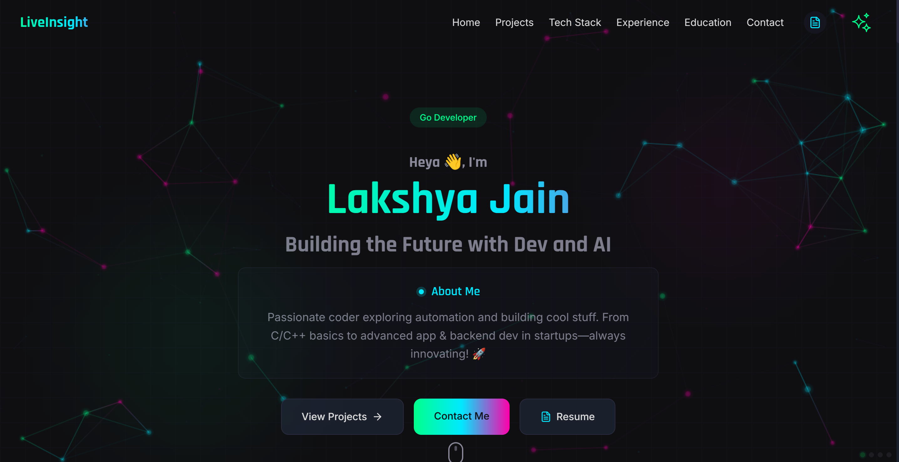
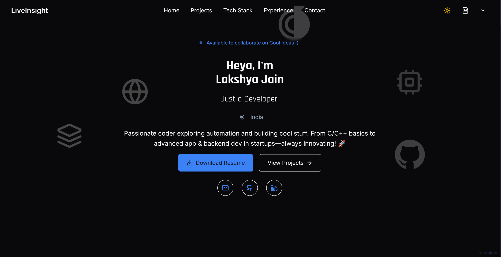
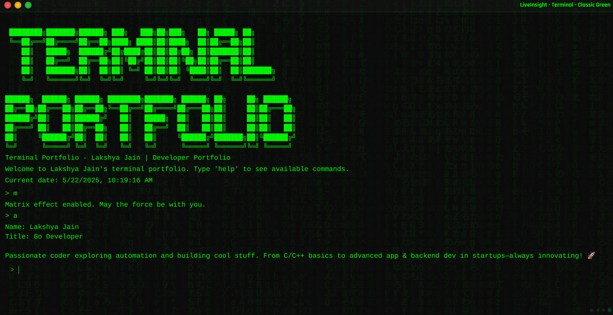
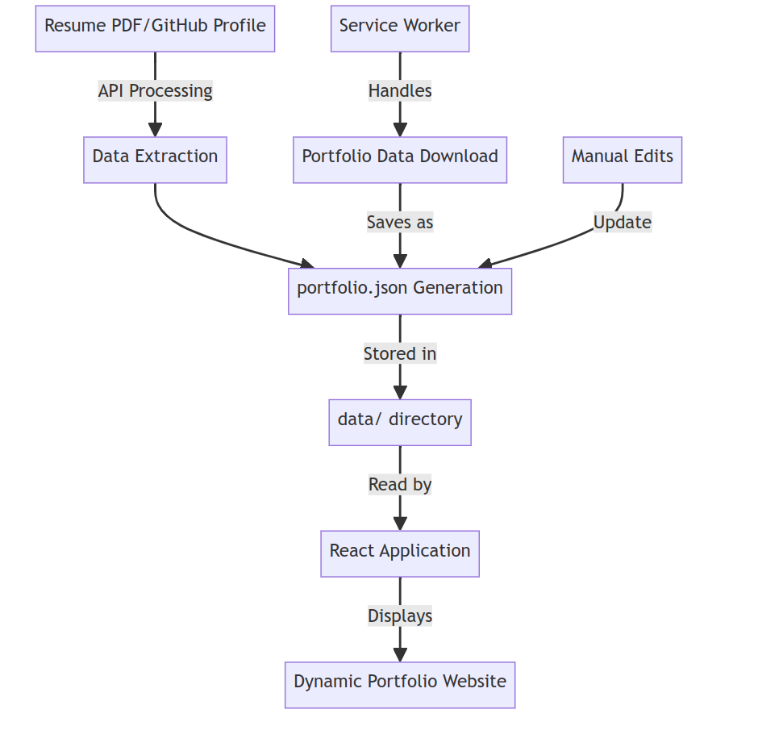

# LiveInsight 🚀

[](https://github.com/lakshya-jain-0291/PortFolio)
[](https://github.com/lakshya-jain-0291/PortFolio)
[](https://github.com/lakshya-jain-0291/PortFolio)
[](https://github.com/lakshya-jain-0291/PortFolio)

A modern, multi-theme developer portfolio that automatically updates based on your GitHub activity, resume, and personal information. This portfolio is designed to evolve with your career, reducing maintenance overhead while providing a professional showcase of your work. Choose from multiple visual themes to match your personal style!

## 🎨 Multiple Portfolio Themes

LiveInsight comes with **3 distinct themes** you can switch between instantly without changing your data:

<details open>
<summary><strong>CyberPunk Tech (Template 1)</strong></summary>
</br>
<p align="center">
    
</p>
A bold and futuristic design featuring neon highlights, custom animations, and a tech-inspired layout. Perfect for developers who want to make a strong visual impression while showcasing their cutting-edge skills and projects.
</details>
</br>
<details>
<summary><strong>Cool Elegant Light/Dark Themed (Template 2)</strong></summary>
</br>
<p align="center">
    
</p>
A minimalist and elegant design with light and dark mode support, perfect for a clean professional appearance with subtle animations and modern typography.
</details>
</br>
<details>
<summary><strong>Terminal Theme (Template 3)</strong></summary>
</br>
<p align="center">
    
</p>
A retro terminal-inspired interface with monospace text, command-line styling, and syntax highlighting. Perfect for showcasing your coding skills with an old-school tech vibe and ASCII art elements.
</details>
</br>

**Switch Templates Easily:** Simply add `?template=1`, `?template=2`, or `?template=3` to your URL to change themes!

## ✨ Features

- **🎭 Multiple Design Themes** - Three distinct visual styles to choose from
- **🤖 Auto-Generated Content** - Portfolio data is automatically generated from your resume and GitHub profile
- **🔄 Dynamic Updates** - Data refreshes from APIs to always show your latest work
- **🌐 GitHub Integration** - Displays repositories, stars, contributions, and commit activity
- **📊 Interactive Stats** - Visual representations of your GitHub activity and technical skills
- **📱 Responsive Design** - Looks great on all devices across all templates
- **🎨 Customizable** - Easy to modify content by editing the portfolio.json file
- **🔒 Local Storage** - Stores portfolio data locally for faster loading
- **🧩 Modular Architecture** - Easy to add new templates without changing the core data model

## 🛠️ Technology Stack


## 🔍 How It Works

LiveInsight uses a simple yet powerful data flow system:

1. **Initial Load**
    - Checks for local portfolio data
    - If not found, fetches from your GitHub profile

2. **Data Processing**
    - Parses your resume PDF (when uploaded)
    - Fetches GitHub repositories and statistics
    - Combines all data into a coherent portfolio model

3. **Storage Layer**
    - Saves processed data to local storage
    - Minimizes API calls to GitHub

4. **Template Selection**
    - Automatically detects template preference from URL parameter
    - Dynamically loads the appropriate template components
    - All templates use the same data model

5. **Rendering Pipeline**
    - Components consume the portfolio data model
    - Updates UI when data changes
    - Applies theme-specific styling to all elements

<p align="center">
    
</p>

6. **Update Mechanism**
    - Manual refresh button for on-demand updates
    - Scheduled background refreshes for latest GitHub data
    - Service worker ensures data consistency

## 🚀 Getting Started

### Prerequisites
- Node.js 16+
- npm or yarn
- Portfolio Automation API key (see below)

### API Key Setup
1. Visit [portfolio-automation.dev](https://portfolio-automation.dev)
2. Create a free account or log in
3. Navigate to your dashboard and generate a new API key
4. Copy your API key for the next steps

### Installation

1. Clone the repository
```bash
git clone https://github.com/username/PortFolio.git
cd PortFolio
```

2. Install dependencies
```bash
npm install
# or
yarn install
```

3. Create a .env file based on .env.example
```bash
cp .env.example .env
```

4. Add your Portfolio Automation API key to the .env file
### Getting an API Key
- Visit [portfolio-automation.dev](https://portfolio-automation.dev)
- Create a free account or log in
- Navigate to the dashboard and click "Generate API Key"
- Copy your new API key and paste it into your .env file
- Your portfolio will now automatically sync with your GitHub profile

```
PORTFOLIO_AUTOMATION_API_KEY=your_api_key_here
```

5. Start the development server
```bash
npm run dev
# or
yarn dev
```

## 📊 Data Management

### Automatic Data Generation

Your portfolio data is automatically generated from:

1. **GitHub Profile** - Projects, stats, stars, and activity
2. **Resume PDF** - Education, experience, and skills
3. **Portfolio Automation API** - Enhances and structures your profile data

### Customizing Your Data

The portfolio.json file controls all displayed content. You can:

1. **Download your data**: Click the Star icon in the header and select "Download Portfolio Data"
2. **Edit the JSON file**: Modify any fields in the downloaded JSON
3. **Place in the data directory**: Save your edited file as portfolio.json
4. **Refresh the page**: Your changes will be automatically loaded

## 📁 Project Structure

```
PortFolio/
├── public/
│   ├── portfolio-service-worker.js  # Handles saving portfolio data
│   └── data/                        # Directory for portfolio.json
├── src/
│   ├── components/                  # UI components for Template 1
│   ├── hooks/                       # Custom React hooks
│   ├── lib/                         # Utility functions
│   │   ├── portfolioStorage.ts      # Data storage functionality
│   │   ├── portfolioReader.ts       # Data reading functionality
│   │   └── githubService.ts         # GitHub API integration
│   └── config/                      # Configuration files
├── src2/
│   └── components/                  # UI components for Template 2
├── src3/
│   ├── components/                  # UI components for Template 3
│   └── styles/                      # Terminal theme styles
└── data/
    └── portfolio.json               # Your portfolio data
```

## 🔄 Update Workflow

1. **Automatic Updates**:
   - When your GitHub profile changes, refresh your portfolio to see the latest stats
   - Upload a new resume to update your education and experience

2. **Manual Updates**:
   - Edit the portfolio.json file directly
   - Place it in the data directory
   - Reload the page to see changes

## 🌟 Key Features in Detail

### Template Switching System
- URL parameter based template selection
- Dynamically loaded React components
- Shared data model across all templates
- Service worker for persistent data

### Dynamic GitHub Stats
- Repository count
- Star count
- Forks count
- Commit activity
- Contribution graph
- Top languages

### Interactive Project Showcase
- Featured projects section
- Filtering and search capabilities
- GitHub stats integration
- Technologies used tags

### Professional Experience Timeline
- Visual timeline of work history
- Achievement highlights
- Company information

### Technical Skills Showcase
- Auto-categorized skill sets
- Proficiency indicators
- Professional tech stack visualization

## ✏️ Adding Your Own Template

The modular architecture makes it easy to add new templates:

1. **Create a new directory** (e.g., `src4/`) with your template components
2. **Update `src/main.tsx`** to include your new template:

```tsx
// Add your new template to the template selector
if (TEMPLATE_CONFIG.TEMPLATE_NUMBER === 4) {
  // Load App from src4 directory for your new template
  const { default: App } = await import('../src4/App')
  return App
} else if (TEMPLATE_CONFIG.TEMPLATE_NUMBER === 3) {
  // Existing terminal template...
}
```

3. **Use the shared data model** from `PortfolioContext`
4. **Style your template** however you want - the data will work with any UI!

## 🤝 Contributing

Contributions are welcome! Please feel free to submit a Pull Request.

## 📝 License

This project is licensed under the MIT License - see the LICENSE file for details.

---

<p align="center">
  <a href="#top">Back to top</a>
</p>

