<a id="top"></a>

# LiveInsight

[](#-three-templates-one-dataset)
[](https://react.dev)
[](https://threejs.org)
[](#-data)

A self-updating developer portfolio. Your resume and GitHub profile are turned into a single `portfolio.json`, and that one dataset is rendered by **three genuinely different design systems**: a WebGL tech showcase, a quiet editorial page, and an interactive terminal.

<p align="center">
  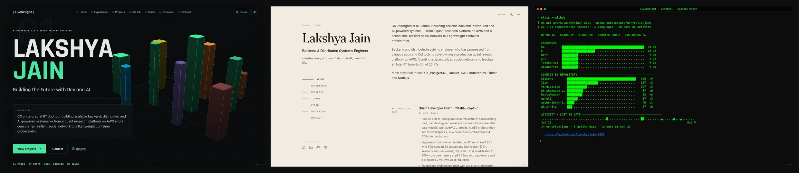
</p>

<p align="center">
  <a href="#-three-templates-one-dataset">Templates</a> ·
  <a href="#-architecture">Architecture</a> ·
  <a href="#-getting-started">Getting started</a> ·
  <a href="#-data">Data</a> ·
  <a href="#-adding-a-template">Add a template</a>
</p>

---

## ✨ Three templates, one dataset

Switch with a query parameter. No rebuild, same data:

| URL | Template | Identity |
| --- | --- | --- |
| `?template=1` | **Dark tech** (`src/`) | WebGL repo field, scroll choreography, single neon accent |
| `?template=2` | **Editorial** (`src2/`) | Warm paper, serif type, hand-drawn charts, light & dark |
| `?template=3` | **Terminal** (`src3/`) | Command line, ASCII charts, Matrix rain, easter eggs |
| `?template=0` | Dark tech, centred | Template 1 with all sections centred and unnumbered |

The default comes from `VITE_TEMPLATE_NUMBER`. The small dots in the bottom-right corner switch templates at runtime.

All three draw their GitHub section from the same normalised dataset (`shared/github/buildGitHubDataset`): repositories, stars, forks, commits, language share and the last 90 days of contributions.

| | Template 1 | Template 2 | Template 3 |
| --- | --- | --- | --- |
| **GitHub stats as…** | A 3D field: one column per repo. Height = commits, footprint = forks, glowing cap = stars, colour = language | SVG bar chart, language ranks and a 90-day activity strip, with a table view | `stats --github`: ASCII bars and a sparkline, streamed like a log |
| **Motion** | GSAP ScrollTrigger (scrubbed) + Lenis smooth scroll | Hand-written Framer Motion variants | Typed/streamed output, Matrix rain |
| **Type** | Rajdhani · Inter · JetBrains Mono | Fraunces · Inter · IBM Plex Mono | JetBrains Mono |
| **Heavy deps** | three.js, R3F, postprocessing (lazy chunk), GSAP, Lenis | none | none |

### Template 1: Dark tech

<p align="center">
  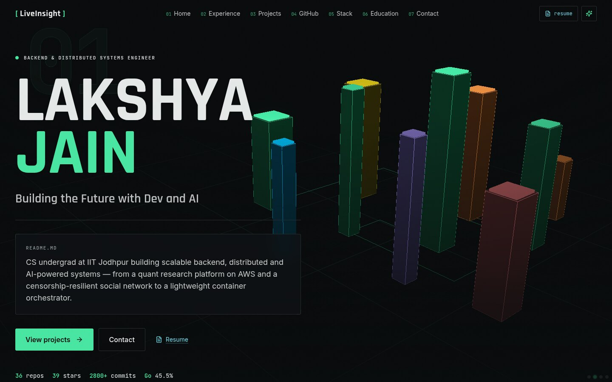
</p>

<table>
  <tr>
    <td width="50%">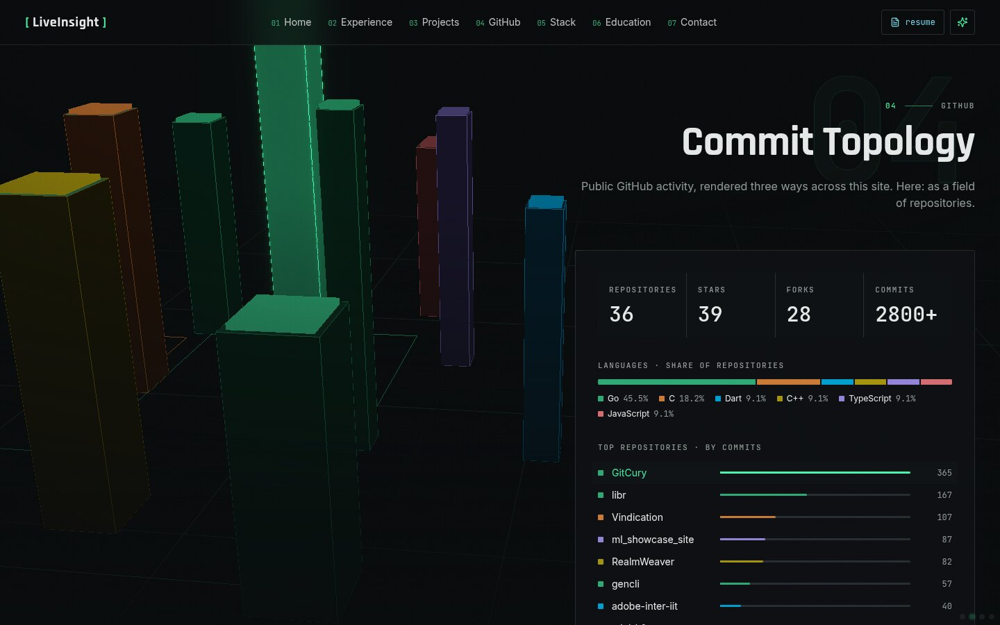</td>
    <td width="50%">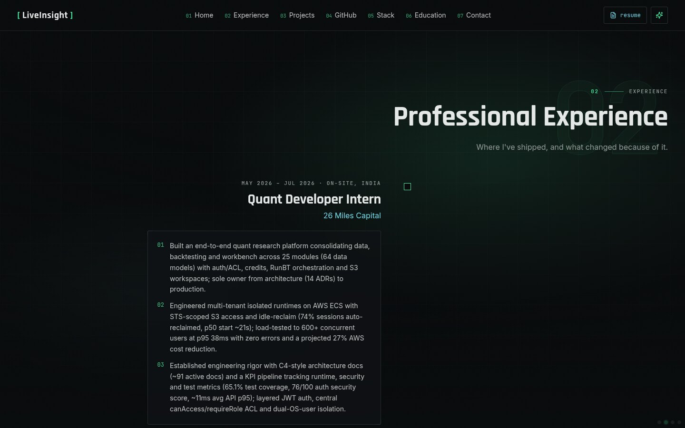</td>
  </tr>
  <tr>
    <td><sub>Hovering a repository in the legend lights up its column in the scene.</sub></td>
    <td><sub>Alternating layout and numbered section watermarks, revealed by scroll.</sub></td>
  </tr>
</table>

- **Repo field.** A custom react-three-fiber scene with bloom. The camera orbits with page scroll, pushes in at the GitHub section, and drifts with the cursor.
- **Built to degrade.** The scene is lazy-loaded when the browser is idle and caps device pixel ratio. It pauses when off-screen or when the tab is hidden. With `prefers-reduced-motion`, no WebGL, or a low-end device, it is replaced by a static isometric SVG of the same data.
- **Detail work.** Film grain, a custom cursor, and project thumbnails in a duotone that clears on hover.
- **Easter egg.** Try the Konami code.

### Template 2: Editorial

<p align="center">
  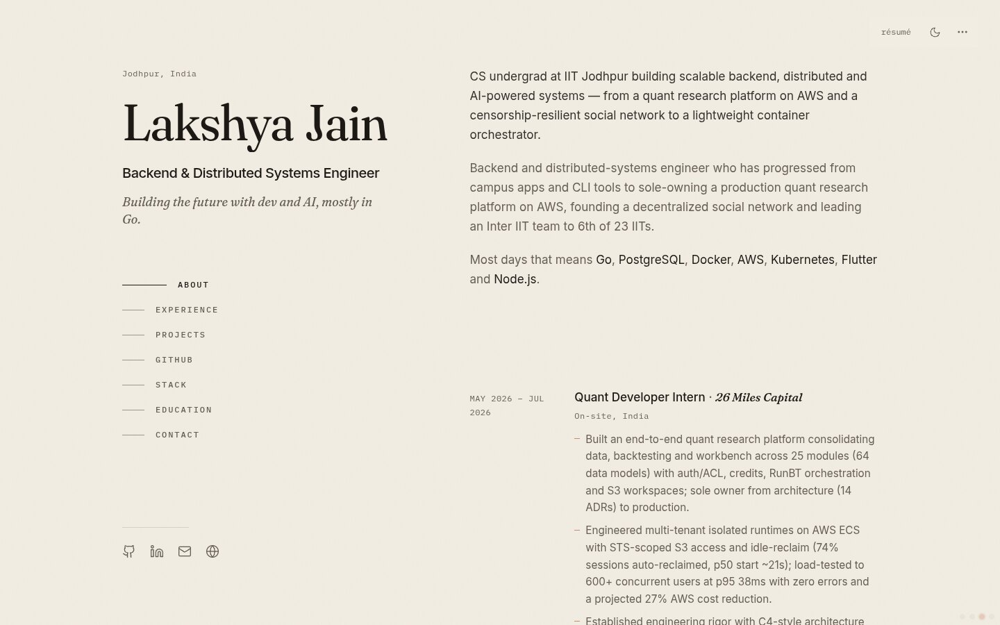
</p>

<table>
  <tr>
    <td width="50%">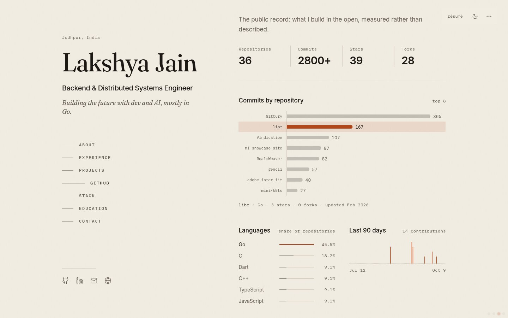</td>
    <td width="50%">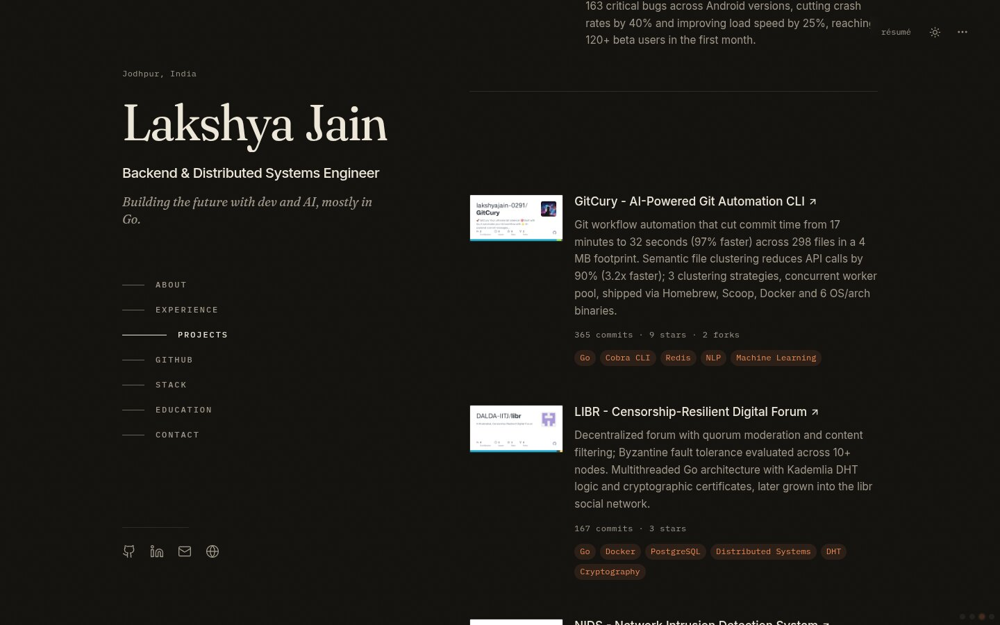</td>
  </tr>
  <tr>
    <td><sub>One accent, values at the bar tips, hover or focus for details.</sub></td>
    <td><sub>A separately designed dark palette, not an inversion.</sub></td>
  </tr>
</table>

- **Layout.** A sticky identity column with live section navigation, and a reading column ordered by `SECTION_NUMBERS`.
- **Colour.** Warm off-white paper, near-black ink and a single burnt-sienna accent. All text passes WCAG AA in both themes.
- **Interaction.** Restraint over spectacle. Hover dims sibling rows; type rises from a baseline mask and rules draw left to right.

### Template 3: Terminal

<p align="center">
  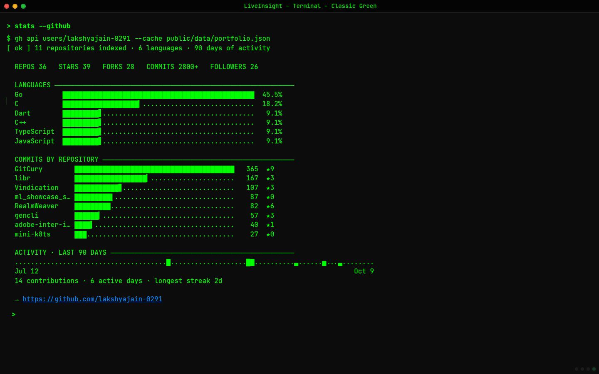
</p>

<table>
  <tr>
    <td width="50%">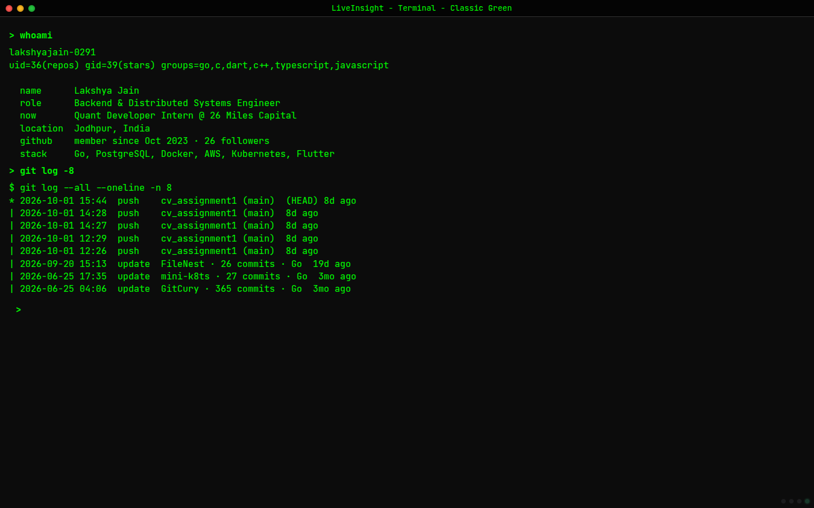</td>
    <td width="50%">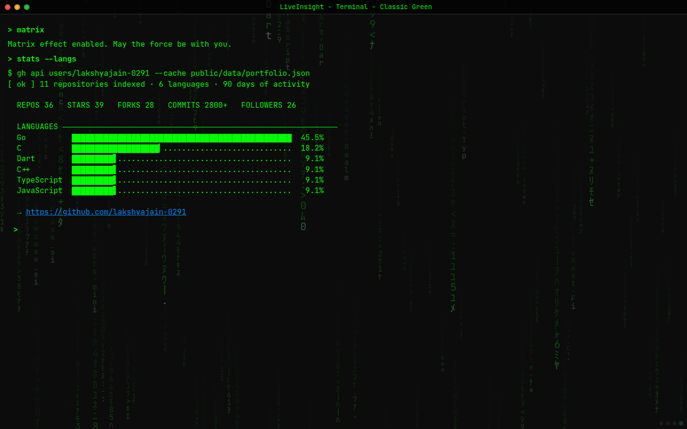</td>
  </tr>
  <tr>
    <td><sub><code>whoami</code> and <code>git log</code> read from the same dataset.</sub></td>
    <td><sub>Three depth layers of rain; some columns spell real repo names.</sub></td>
  </tr>
</table>

| Command | Aliases | What it does |
| --- | --- | --- |
| `help` | `h`, `?` | List every command |
| `about` · `experience` · `projects` · `education` · `skills` | `a`, `e`, `p`, `edu`, `s` | Portfolio sections (skills as ASCII bars) |
| `stats --github` | `github`, `gh`, `stats`, `g` | GitHub dashboard (`--langs`, `--repos`, `--activity` for one panel) |
| `whoami` | `who` | Identity, current role, stack, GitHub age |
| `git log` | `gl` | Recent pushes and repository updates (`git log -5`) |
| `matrix` · `theme <name>` | `m` | Toggle the rain · switch colour scheme |
| `download -p` / `-r` | `dlp`, `dlr` | Download `portfolio.json` / the resume |
| `reload` | `r` | Regenerate data through the AI backend |
| `fortune`, `typingtest`, `coffee`, `cow`, `42`… | | Easter eggs (and there's a Konami code) |

Press <kbd>Enter</kbd> to fast-forward streamed output. <kbd>Tab</kbd> completes commands, and <kbd>↑</kbd>/<kbd>↓</kbd> walk the history.

### On mobile

<p align="center">
  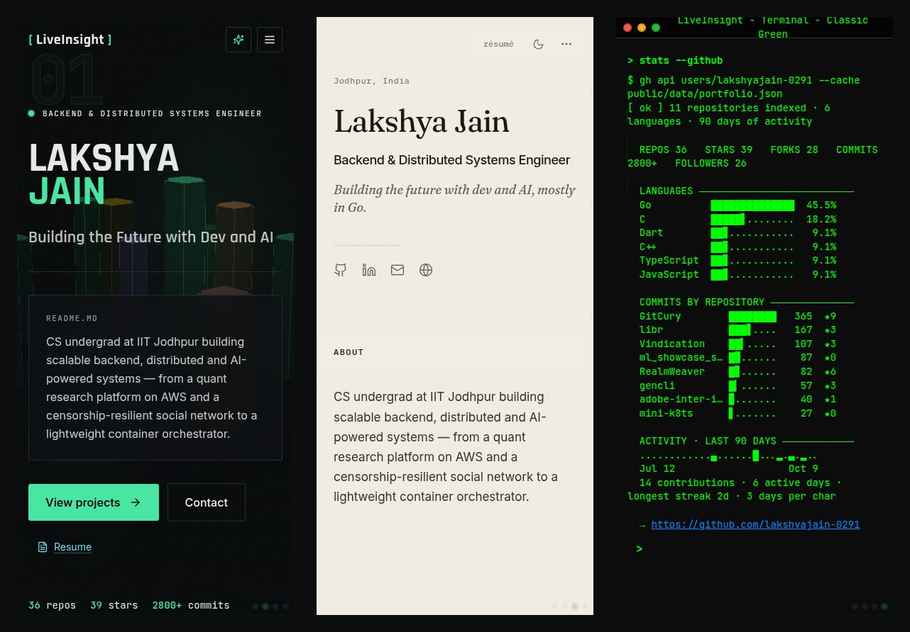
</p>

---

## 🧭 Architecture

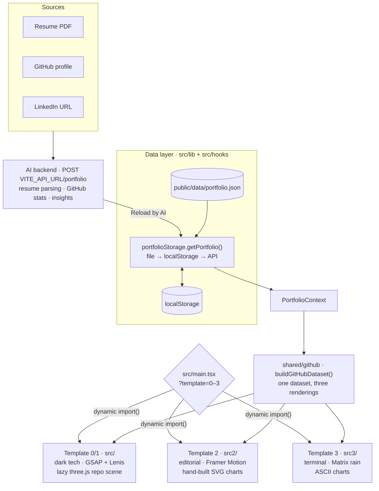
```mermaid
flowchart TB
  subgraph SRC["Sources"]
    direction LR
    R["Resume PDF"]
    GH["GitHub profile"]
    LI["LinkedIn URL"]
  end

  API["AI backend · POST VITE_API_URL/portfolio<br/>resume parsing · GitHub stats · insights"]

  subgraph DATA["Data layer · src/lib + src/hooks"]
    direction LR
    JSON[("public/data/portfolio.json")]
    PS["portfolioStorage.getPortfolio()<br/>file → localStorage → API"]
    LS[("localStorage")]
  end

  CTX["PortfolioContext"]
  SH["shared/github · buildGitHubDataset()<br/>one dataset, three renderings"]
  SEL{"src/main.tsx<br/>?template=0–3"}

  T1["Template 0/1 · src/<br/>dark tech · GSAP + Lenis<br/>lazy three.js repo scene"]
  T2["Template 2 · src2/<br/>editorial · Framer Motion<br/>hand-built SVG charts"]
  T3["Template 3 · src3/<br/>terminal · Matrix rain<br/>ASCII charts"]

  SRC --> API
  API -- "Reload by AI" --> PS
  JSON --> PS
  PS <--> LS
  PS --> CTX
  CTX --> SH
  SEL -- "dynamic import()" --> T1 & T2 & T3
  SH --> T1 & T2 & T3
```

<sub>Source: <a href="./docs/architecture.mmd"><code>docs/architecture.mmd</code></a> · rendered image for viewers without Mermaid support: <a href="./assets/architecture.png"><code>assets/architecture.png</code></a></sub>

**How a page loads**

1. `src/main.tsx` reads `?template=` (or `VITE_TEMPLATE_NUMBER`) and dynamically imports only that template's `App`. Each template ships its own stylesheet and dependencies.
2. `PortfolioContext` loads data in priority order: `public/data/portfolio.json`, then `localStorage`, then the AI backend as a last resort.
3. Templates read sections straight from the context. GitHub numbers go through `shared/github`, so every template shows identical figures.
4. **Reload by AI** (header menu, or `reload` in the terminal) posts the resume and profile URLs to the backend, then stores the regenerated data.

**Bundle isolation.** three.js, GSAP and Lenis appear only in Template 1's graph, and three.js only in its lazy `RepoScene` chunk (~257 kB gzipped). Templates 2 and 3 load none of them.

**Accessibility.** Every animated layer honours `prefers-reduced-motion`: the WebGL scene becomes a static poster, Lenis and GSAP reveals are skipped, Framer Motion drops transforms, and terminal output prints instantly. Charts in Template 2 have a table view, and focus states match hover states.

---

## 🚀 Getting started

**Prerequisites:** Node.js 18+ and npm.

```bash
git clone https://github.com/lakshyajain-0291/PortFolio.git
cd PortFolio
npm install
cp .env.sample .env      # fill in what you need (see below)
npm run dev              # http://localhost:8080/?template=1
```

The site renders entirely from `public/data/portfolio.json`, so **no backend is needed** to run or deploy it.

### Configuration

All settings are optional `VITE_*` variables. Defaults live in `src/config/env.ts`.

| Variable | Purpose |
| --- | --- |
| `VITE_TEMPLATE_NUMBER` | Default template (`0`–`3`) when no `?template=` is given |
| `VITE_PORTFOLIO_FILE_PATH` | Where to load the data file from (default `/data/portfolio.json`) |
| `VITE_DEFAULT_RESUME_URL` | Resume served for download and sent to the backend (default `/resume/resume.pdf`) |
| `VITE_API_URL`, `VITE_API_KEY` | AI backend endpoint and key, used only by **Reload by AI** |
| `VITE_DEFAULT_NAME`, `VITE_DEFAULT_TITLE`, `VITE_DEFAULT_EMAIL`, `VITE_DEFAULT_BIO` | Fallback identity if the data file is missing |
| `VITE_DEFAULT_GITHUB_URL`, `VITE_DEFAULT_LINKEDIN_URL`, … | Fallback social links |
| `VITE_APP_NAME`, `VITE_SITE_TITLE`, `VITE_META_DESCRIPTION`, `VITE_OG_IMAGE_URL` | Branding and meta tags |

Section order (and Template 1's numbered watermarks and left/right rhythm) comes from `SECTION_NUMBERS` in `src/config/env.ts`.

### Scripts

| Command | |
| --- | --- |
| `npm run dev` | Vite dev server on port 8080 |
| `npm run build` / `npm run preview` | Production build / serve it locally |
| `npm run lint` | ESLint (typescript-eslint) |
| `npm run server` · `npm run dev:full` | Start the AI backend from `server/` (alone or alongside Vite), if you have it checked out |

Deploys as a static site; `vercel.json` already rewrites all routes to the SPA.

---

## 📊 Data

`public/data/portfolio.json` holds everything the templates show: personal info, experience, education, projects, skills, AI insights, tech stack, `githubStats`, and `githubData` (repositories, language stats, 90 days of contributions, recent activity).

**To edit your portfolio**

1. Open the header menu (✦ in Template 1, ⋯ in Template 2, or `download -p` in the terminal) and download `portfolio.json`.
2. Edit any field.
3. Save it to `public/data/portfolio.json` and reload.

**To regenerate it**, point `VITE_API_URL` / `VITE_API_KEY` at the AI backend, put your resume at `public/resume/resume.pdf`, and choose **Reload by AI**. The backend parses the resume, pulls GitHub data and writes fresh insights.

---

## 📁 Project structure

```
PortFolio/
├── public/
│   ├── data/portfolio.json          # the single source of portfolio content
│   ├── resume/resume.pdf            # served for download and sent to the backend
│   └── portfolio-service-worker.js
├── shared/                          # data helpers used by every template (no UI)
│   ├── github/                      # buildGitHubDataset, useGitHubDataset
│   ├── hooks/                       # usePrefersReducedMotion
│   └── format.ts                    # resume date ranges
├── src/                             # boot + data layer + Template 0/1
│   ├── main.tsx                     # template selection (dynamic import)
│   ├── config/env.ts                # env defaults, SECTION_NUMBERS
│   ├── lib/ · hooks/                # portfolioStorage, portfolioReader, PortfolioContext…
│   ├── components/                  # Template 1 sections + shadcn/ui primitives
│   │   └── t1/                      # RepoScene (WebGL), SceneBackdrop, GSAP/Lenis, cursor
│   └── template1.css
├── src2/                            # Template 2 · editorial
│   ├── components/                  # sections, GitHubChart (SVG)
│   ├── motion.ts · sections.ts
│   └── template2.css
├── src3/                            # Template 3 · terminal
│   ├── components/                  # Terminal, MatrixEffect
│   ├── utils/                       # commands, easter eggs, ASCII charts
│   └── styles/terminal.css
├── docs/architecture.mmd            # Mermaid source for the diagram above
└── assets/                          # README screenshots and diagram
```

---

## 🧩 Adding a template

1. Create `src4/` with an `App.tsx` wrapped in `PortfolioProvider`.
2. Read content from `usePortfolio()` and GitHub numbers from `useGitHubDataset()`.
3. Import your own stylesheet from `src4/App.tsx`, and keep heavy dependencies inside that tree so other templates don't pay for them.
4. Register it in `src/main.tsx`:

```tsx
if (TEMPLATE_CONFIG.TEMPLATE_NUMBER === 4) {
  const { default: App } = await import('../src4/App')
  return App
}
```

5. Widen the `?template=` check in `src/config/env.ts`, add a dot to `TemplateSwitcher`, and add `./src4/**/*.{ts,tsx}` to `content` in `tailwind.config.ts`.

---

## 🛠️ Built with


## 🤝 Contributing

Issues and pull requests are welcome. Please run `npm run lint` and `npm run build` before opening a PR.

## 📝 License

MIT

<p align="center"><a href="#top">Back to top ↑</a></p>
